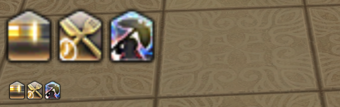

============================
 고양감 16 스택 (HighWire16Stacks)
============================

- **고양감 16 스택 (HighWire16Stacks)** 는 자기 캐릭터의 버프를 별도의 창으로 보여주는 프로그램입니다.

- 버프창에 버프가 너무 많아서 원하는 버프를 빠르게 찾기 힘들어 만들었습니다

정보
----
:최신 버전: `v2018.2.10.1 <https://github.com/RyuaNerin/HighWire16Stacks/releases/latest>`_
:파이널 판타지 버전: v4.05

사용방법
-------
- 상단 최신버전의 링크에서 `HighWire16Stacks.exe` 파일을 원하는 경로에 다운로드 후, 실행합니다.
- 실행이 되지 않을 시 `.Net Framework 4.5 <https://www.microsoft.com/ko-kr/download/details.aspx?id=30653>`_ 를 다운로드하여 설치해주세요.

기능
----
- 내가 원하는 버프만 보이기, 혹은 숨기기
- 버프의 소수점 자리 표시
- 큰 버프 아이콘
- 버프를 남은 시간순으로 표시
- 투명도 조절 가능

스크린샷
-------

인터페이스
~~~~~~~~~~~

오버레이 : 확대 + 모두 표시 + 소수점 표시
~~~~~~~

오버레이 : 확대 + 시간순 정렬
~~~~~~~

오버레이 : 확대 + 특정 버프 숨기기 + 시간순 정렬
~~~~~~~

오버레이 : 확대 + 특정 버프 숨기기 + 시간순 정렬 + 소수점 표시
~~~~~~~

LICENSE
-------
:Final Fantasy XIV: `(C) 2010 - 2017 SQUARE ENIX CO., LTD All Rights Reserved. Korea Published by EYEDENTITY MOBILE.`
:FBOverlay: `GNU GENERAL PUBLIC LICENSE v3 LICENSE <LICENSE>`_

기타
-------
- 060000.win32.index : IconModifier
- 010000.win32.index : status.exh_ko.csv
- memory offset : offset.txt
- 부드러운 이미지 : icons_waifu2x_art_noise3_scale_tta_1
